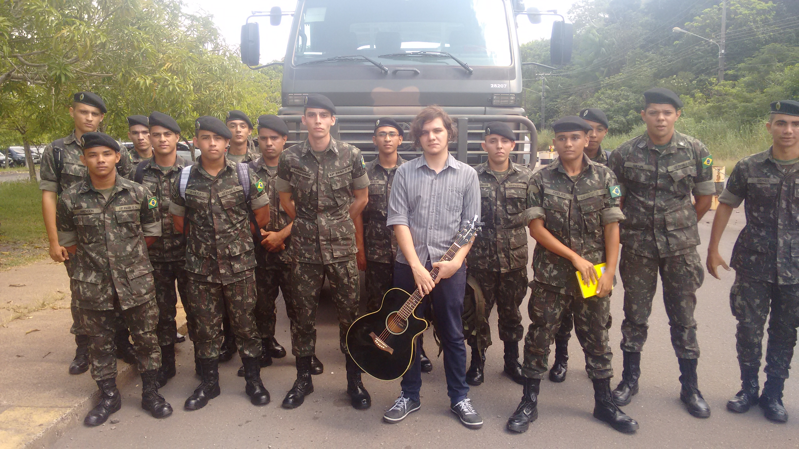
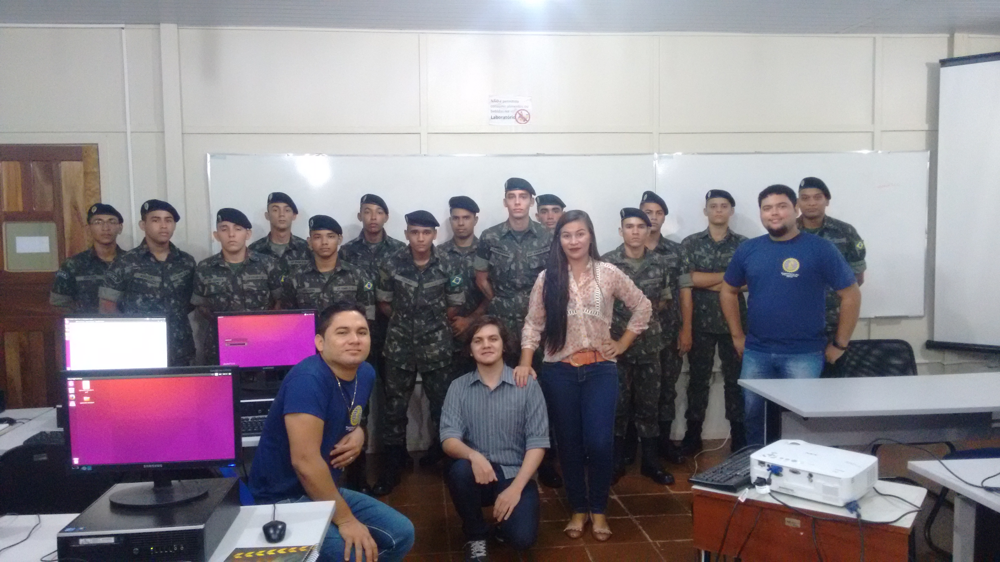

# Python para Zumbis na Amazônia

O curso de 8h, dado em 2 dias corridos de 4h cada no período da manhã, foi lencionado nos dias 23 a 24 de Junho de 2016 na Universidade Federal do Pará para os aspirantes do 23º batalhão do Exército Militar de Tucuruí, tendo como seu principal instrutor **Manoel Vilela** e o restante do grupo da disciplina de Atividades Extracurriculares de Extensão no 4º semestre do curso de Engenharia da Computação na cidade de Tucuruí Pará.

# Instrutor Principal

## Fotos da Turma

Primeiro dia:

Segundo dia:

## Estrutura do curso:

* 1º Dia:
    - [Estrutura Sequencial](aulas/EstruturaSequencial)
    - [Estrutura de Decisão](aulas/EstruturaDeDecisão)
* 2º Dia:
    - [Estruturas de Repetição](aulas/EstruturaDeRepetição)
    - [Manipulação de Strings](aulas/ManipulaçãoDeStrings)

## Agradecimentos

* Fernando Massanori por oferecer o curso Python para Zumbis na qual me encontrei no mundo da computação e pude entender o que era verdadeiramente ensinar.
* Todo a excelente disciplina do 23º batalhão do Exército Militar a qual os instrui e tiveram com certeza um grande proveito mesmo tendo suas dificuldades por uma base não tão sólida.
* A minha paciência com a UFPA e os professores que nos fazem sofrer pra aprender :D
* Os outros alunos filhas da puta que não ajudam muita coisa, mas dão um ótimo exemplo do que não devemos ser.
* Python por ser uma linguagem tão legal, poderosa e fácil de começar nesse mundo maravilhoso da computação!

## Grupo da UFPA

* Manoel Vilela
* Débora Porto
* Josias 
* Yan Brito

## Licença
Creative Commons Share A Like 3.0

Você está livre para:

**Compartilhar** — copiar e redistribuir o material em qualquer meio ou formato
**Adaptar** — remixar, transformar, e construir em cima do material

Para qualquer propósito, até comercial.

